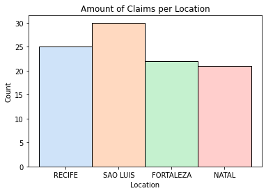
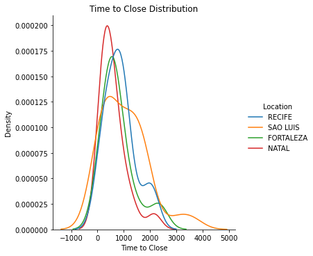
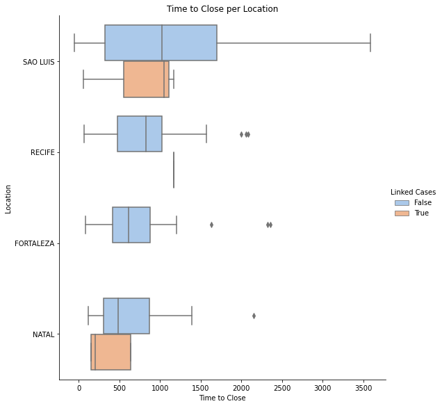
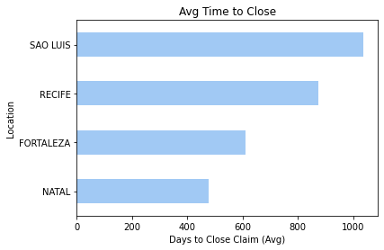

# <u>An Analysis on a Fast Food Company's Customer Claims in Brazil</u>
### <u>EXECUTIVE SUMMARY</u>

This report is an analysis on the data retrived from the legal department of the Vivendo fast food chain who process customer claims across four locations. The aim is to ascertain whether there indeed is a difference between the time it takes to close a claim within the company across these four distinct locations: Sao Luis, Recife, Fortaleza & Natal. This information will inform the new head of the legal department at Vivendo Fast Food Company. 

The report focuses on three key questions:

- How does the number of claims differ across locations?
- What is the distribution of time to close claims?
- How does the average time to close claims differ by location?

### <u>Data Discovery & Validation</u>
The main data source is the claims dataset that has been provided by the legal team where each row is a claim made against the company. The first task is to validate the data by making sure each observation has a correct record of each of the data's markers: 
- Claim ID
- Time to Close
- Claim Amount
- Amount Paid
- Location
- Individuals on Claim
- Linked Cases
- Cause

On first inspection, after printing a consise summary of the dataframe, there are 98 entries in all columns apart from the Cause column, which categorizes the claims in either; 'meat', 'vegeatable' or 'unknown'. The column contains 78 null values which can be cleaned by filling each NaN value with an 'unknown' value in place.

Secondly, the Claim Amount column which is classified as an object datatype column, should be an integer column. The current values contain three inconsistencies that should be removed; a curreny symbol ('R$'), a float decimal ('.00') and a comma(',') all in string formart.

We do this by;
1. Creating a dictionary with our inconsistencies and their replacements, which in this case are empty since we want to remove these characters. 
2. Run a loop on each dictionary item and apply the changes from our dictionary to each value in the Claim Amount column 
3. Change the datatype of the whole column to an integer

We can also check whether we have a similar count of our records across all columns; which is 98 entries. 

As well as confirm that there are no duplicates using the unique identifier (Claim ID).

Finally, we can confirm the datatypes for each of the remaining columns to coincide with the correct datatype required as per the instructions.  

Once all columns are validated and our data is clean, we can finally begin our analysis.

### <u>Exploratory Data Analysis</u>

<b>Qstn 1. How does the number of claims differ across locations?</b>

Let's determine how the claims are dispersed according to locations. Let's start by analysing the amount of claims per location

We start by counting the records per each location and discover the amount of active claims in each location:

- Sao Luis has <b>30 (30.61%)</b> claims
- Recife has <b>25 (25.51%)</b> claims
- Fortaleza has <b>22 (22.45%)</b> claims
- Natal has <b>21 (21.43%)</b> claims

There definitely appears to be a difference in the number of claims each location handles but the difference is slight and under 10%

<b>Qstn 2. What is the distribution of time to close claims?</b>

Lets look at the time to close data distribution first

To answer this question, lets analyze the comparison between how long it takes to close a claim across the four different locations while maintaining the descending order seen in the Amount of Claims per location graph above

We can observe how right skewed our distribution is across all locations due to the outliers. However, we cannot remove or replace these outliers since they are necessary.

Observations:
- There is a pattern that annotates that the locations with a higher number of claims generally take a longer time to close.
- There is a difference between how quick cases that are linked to another case and those that are not linked to another case are closed. Sao Luis takes a longer time to close linked cases compared to Natal that closes linked cases faster than non-linked cases

<b>Qstn 3. How does the average time to close claims differ by location?</b>

Based on our above findings lets explore deeper how varied the average time to close a claim is in different locations. 

The mean, is greatly affected by outliers and so in this case we will use the median to attain a more accurate figure.

The average time to close a claim within the whole Vivendo Company is about <b>638 days</b>. 

The locations with a higher number of claims still seem to have a higher average time to close, with Sao Luis and Natal being the highest and lowest locations in average time, respectively.

On average:
- Sao Luis takes <b>1037.5 days</b> 
- Recife takes <b>875.0 days</b> 
- Fortaleza takes <b>611.0 days</b> 
- Natal takes <b>477.0 days</b> 

## Conclusions

Based on the results of the above analysis, this section aims to summarise all the observations collected. Firstly, the main goal of this analysis was to accertain whether there are differences in the time it takes to close claims across the locations. 

1. We have observed how distributed our data in regards to the amount of time it takes to close a claim is. Despite there being a less than 10% difference in between the different locations, there still is a lot to analyse from this data.
2. The average time to close a claim within the whole company was discovered to be 638 days
3. Locations with a higher number of claims take a longer time to close those claims, with Sao Luis having both the highest claims cases and taking the longest time to close 
4. Only the Natal location has optimized its processes to be able to handle closing linked cases at a faster rate compared to the other locations
5. Non-linked cases take the longest time to close across all locations

We can therefore conclude that there indeed is a difference in time taken to close a claim between all four Vivendo Fast Food legal team locations.